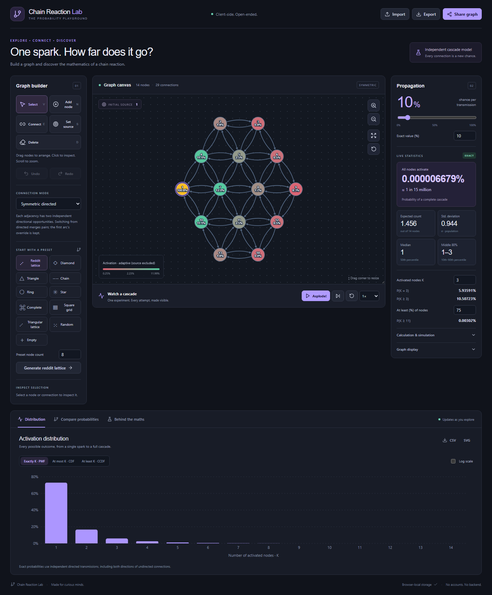

# Chain Reaction Lab

**One spark. How far does it go?**

An interactive mathematical laboratory for probabilistic propagation on graphs. Build a network, choose an initial source, and watch its probability distribution change as you add connections. Explore cascade sizes, alternate paths, directed transmission, and the difference between a possible transmission and the connection that actually causes an activation.

Runs entirely in your browser. No backend, accounts, database, analytics, paid services, or external runtime requests. Your graph stays in browser-local storage unless you export or share it.



**Live application:** not published yet. This repository currently has no GitHub remote, so an actual live URL cannot be supplied. After publication the application will be at `https://YOUR-USERNAME.github.io/YOUR-REPOSITORY/`. Replace this sentence with your live application link when setting up the public repository.

## Explore

- **Interactive Cytoscape graph editor:** place, drag, select, connect, remove, and choose the initial source. Pan, fast wheel zoom, resize the canvas vertically, fit, reset layout, undo, and redo.
- **Three connection modes:** undirected adjacency, symmetric directed adjacency, and arbitrary directed arcs. Each direction is an independent transmission opportunity.
- **Eleven presets:** the reference Reddit lattice, diamond, triangle, chain, ring, star, complete graph, square grid, triangular lattice, random graph, and empty canvas. Generators support up to 200 nodes, including a 25-node 5×5 grid.
- **Live analytical results:** subset dynamic programming for up to 14 nodes; distribution, node marginals, mean, variance, standard deviation, percentiles, and custom tail thresholds.
- **Monte Carlo:** seeded runs from 1 to 10 million trials, progress, cancellation, optional automatic runs, and 95% Wilson confidence intervals. Larger graphs automatically use simulation.
- **Statistical charts:** PMF, CDF, CCDF, multiple probability overlays, logarithmic axes, precise tooltips, CSV data, and SVG chart export.
- **Comparison laboratory:** customizable global probabilities and activation thresholds, separate expected-count and full-activation charts, median and 10th/90th percentiles.
- **Graph overlays:** configurable red-to-green probability gradient, adaptive logarithmic node colours excluding the source, node chances, connection labels, directions, and simulation-only eligibility/causation metrics.
- **Animated experiments:** “Asplode!”, pause, step, restart, speed controls, seeded replay, and green/red transmission attempts.
- **Mathematical explanation:** clickable final-subset table and heterogeneous outward failure products.
- **Sharing:** browser-local persistence, validated versioned JSON import/export, and backend-free URL fragments.

## Run locally

Use **Node.js 22.12 or newer** and npm. Node 22 is used in GitHub Actions.

```sh
npm ci
npm run dev
```

Open the local address printed by Vite (normally `http://127.0.0.1:5173`).

On Windows, stop any running dev or preview servers with **Ctrl+C** before running `npm ci`. Vite uses `esbuild.exe`, and Windows prevents npm from replacing that file while it is running. If installation fails with `EPERM` on `esbuild.exe`, stop the servers and rerun `npm ci`; an interrupted install can leave `vite` unavailable until installation completes.

```sh
npm test              # Mathematical engine and JSON/model tests
npm run build         # TypeScript checks and production build → dist/
npm run preview       # Serve the production build locally
```

Optional browser tests:

```sh
npx playwright install chromium
npm run test:e2e
```

The Playwright checks start the dev server when needed and cover editor history, worker results, comparisons, animation, simulation, exports, local persistence, sharing, and mobile fit. They also generate the README screenshots in `docs/`.

## Using the editor

Choose a preset, or choose **Add node** and click the canvas. In **Connect**, click two nodes to toggle their connection. For directed arcs, the first node is the source. Select a connection to set its optional probability override. In symmetric mode, both displayed arrows use that adjacency’s override; switch to general directed mode to configure directions separately.

New sessions start with the supplied 14-node **Reddit lattice**: rows of 2–3–4–3–2 nodes, independent arcs in both directions between nearest neighbours, and the source at the left of the middle row (the centre of the reference image’s red circle). Existing browser-local graphs are preserved; click **Reddit lattice** to load the new default into an existing session. The red circle in the reference defines nearest-neighbour range; it is not an additional connection or probabilistic event.

Drag the canvas’s lower-right corner to change its height. Its minimum height is 420 pixels. The existing zoom, pan and fit controls continue to work after resizing.

Node colours use an **adaptive logarithmic curve** by default. The minimum and maximum activation probabilities among non-source nodes determine the colour range, so a certain source does not compress every other node into red. The source is yellow with a purple outline. Legend values show the actual probabilities represented by the low, middle and high colours; node labels and statistics retain their actual probabilities. Equal probabilities receive equal colours. Disable **Adaptive colour curve (exclude source)** in Graph display to restore the absolute 0–100% scale. Connection colours keep their configured or simulation-causation scale.

The full-activation statistic uses ordinary decimals through magnitude `10⁻⁶%` (for example `0.00000679%`), then scientific notation at `10⁻⁷%` and below. Its rounded inverse odds use named magnitudes, such as **1 in 15 million**, through **999 quadrillion**; larger denominators use scientific notation. A zero Monte Carlo estimate is labelled as no full activations observed, rather than an infinite real-world waiting time.

Changing undirected or symmetric adjacency to general directed expands it into two arcs. Changing directed arcs to adjacency merges opposite pairs and keeps the first arc’s override. This conversion is undoable.

Hover a node for its activation probability and connectivity. Hover a connection for configured conditional transmission, source activation, and—after a simulation—its attempt and causation estimates. Probability controls and charts update after a 300 ms debounce; moving nodes preserves results and the viewport.

| Shortcut | Action |
| --- | --- |
| V / N / E / S / D | Select / add / connect / source / delete tool |
| Delete / Backspace | Remove selection |
| Ctrl or Cmd + Z | Undo |
| Ctrl or Cmd + Shift + Z, Ctrl or Cmd + Y | Redo |
| F | Fit graph |
| Escape | Clear selection/highlight, exit editing tool, pause |

History retains the last 80 edits. Dragging, source changes, probability edits, presets, and imports are undoable. Controls remain touch-accessible on narrow screens; the canvas appears first on mobile.

## Probability model

This is the **independent cascade model**:

1. The source activates with certainty.
2. Each activated node independently attempts every outgoing connection whose target has not already activated.
3. A connection succeeds with its configured probability `p_uv` (an override or the global probability).
4. A node activates at most once; each outgoing arc has at most one eligible attempt.
5. The process ends when the activation queue is exhausted.

An undirected adjacency represents **two independent directional arcs**, not one shared random event. The symmetric directed mode uses the same mathematics and displays both arrows. An equivalent analytical view samples successful arcs independently in advance and finds the nodes reachable from the source.

For a subset `S` containing source `s`, let `F(S)` be the chance of reaching all nodes using only the graph induced by `S`:

```text
F({s}) = 1
F(S) = 1 − Σ F(T) × ∏ (1 − p_uv)
            proper T ⊂ S containing s; arcs u ∈ T → v ∈ S \ T

P(final = T) = F(T) × ∏ (1 − p_uv)
                       arcs u ∈ T → v ∈ V \ T
```

The engine memoizes subsets with bitmasks and precomputes failure products. Trees use equivalent unique-path products to preserve tiny probabilities. Summing final sets of size `k` gives `P(K = k)`. Summing subsets containing a node gives its activation probability; the expected count also equals the sum of these node marginals. The variance is the population variance of `K`, not a sample estimator.

Percentage thresholds use `ceil(node_count × percentage / 100)`. Percentiles use the smallest integer `k` whose cumulative probability reaches the requested fraction. The plotted middle 80% is the 10th through 90th percentile interval of this discrete distribution.

### Exact versus simulation

“Exact” means an exhaustive analytical calculation rather than sampling. Arithmetic uses IEEE-754 floating-point numbers, not symbolic fractions. The recurrence takes approximately `O(n × 3^(n−1))` time and `O(n × 2^n)` working storage, plus subset explanations. The supported exact limit is **14 nodes**. Dense 14-node calculations measured roughly **36 ms** on the development machine; browser/hardware timings vary. All calculation modes run in Web Workers, and obsolete workers are terminated after graph changes.

For cyclic subsets near floating-point resolution, subtraction can hide very rare positive outcomes or lose relative precision. The application reports a precision warning when a reachable cyclic internal probability is at or below `1e−12`; it does not imply a rigorous error bound. Tree products remain stable for much smaller probabilities. Monte Carlo also cannot resolve rare events that have never been observed—an estimated zero is not proof of impossibility.

Monte Carlo samples the same model with a FIFO activation queue. Outgoing connections are processed in stored edge order, and a target becomes active immediately on success. Animation uses this identical order. A seed reproduces results for the same graph, edge ordering, and trial count. Seeded runs use a deterministic 32-bit generator; unseeded runs use `Math.random()`.

Connection metrics are deliberately separate:

| Metric | Meaning |
| --- | --- |
| Configured `p_uv` | Conditional chance of success given an eligible attempt |
| Source activation | Chance that the source of this arc activates |
| Eligible attempt | Chance source is processed while target remains inactive; FIFO simulation only |
| Causes activation | Chance this arc succeeds on an eligible attempt; FIFO simulation only |

`P(source activates) × p_uv` is **not** reported as an exact causation probability. Competing routes can activate a target first.

Wilson confidence intervals are provided for Monte Carlo histogram bins. They are marginal 95% intervals, not simultaneous guarantees across every bin. The full-activation interval appears in simulation controls, and every bin’s interval is exported to CSV. Comparison graphs above 14 nodes use at most 100,000 trials per setting, with the selected seed.

### Known results at p = 10%

| Graph and source | P(all activate) |
| --- | ---: |
| One isolated source | 100% |
| Two connected nodes | 10% |
| Three-node chain, endpoint source | 1% |
| Three-node triangle | 2.8% |
| Diamond: 1–A, 1–B, 1–C, A–B, B–C; source 1 | 0.694% |

Tests also check normalization, marginals, directed/disconnected graphs, heterogeneous probabilities, certain/impossible transmission, independently enumerated arc states, seeded convergence, and simulation causation.

## Save and share

Graph state—topology, positions, source, global probability, mode, and overrides—is saved automatically in `localStorage`. JSON export is a portable backup. Import validates IDs, positions, references, probabilities, duplicate connections, and format version. Import supports up to 2,000 nodes and 100,000 connections; simulation runtime still scales with graph size and trial count.

```json
{
  "version": 1,
  "graph": {
    "mode": "directed",
    "probability": 0.1,
    "source": "1",
    "nodes": [
      { "id": "1", "x": 100, "y": 200 },
      { "id": "2", "x": 300, "y": 200 }
    ],
    "edges": [
      { "id": "e1", "source": "1", "target": "2", "probability": 0.25 }
    ]
  }
}
```

Node/edge IDs are unique strings and distinct from one another. Self-connections and duplicate arcs/adjacencies are rejected by the importer. Omit an edge’s `probability` to inherit the global value. In adjacency modes, store a pair once. Empty graphs have `source: ""`.

Try [diamond.json](examples/diamond.json), [triangle.json](examples/triangle.json), or [directed-routes.json](examples/directed-routes.json). Import them with the toolbar.

**Share graph** copies a link with the JSON encoded in the URL fragment. The fragment is read by the browser and is not sent to the hosting server. A shared fragment takes precedence over local storage on load; open the plain application URL to resume your browser-local graph. Large graphs produce long links that some applications truncate; use JSON instead. The URL contains your graph openly, so share it only with the intended recipients. Browser storage is local to the current origin and is not synchronized across devices.

## Deploy to GitHub Pages

The project is prepared for Pages but has **not** been published. Creating a GitHub repository, authenticating, and pushing this code remain actions for the repository owner to authorize.

1. Create or choose a public GitHub repository and push this project to its `main` branch.
2. Open **Settings → Pages** and choose **GitHub Actions** as the source.
3. Allow the workflow in [.github/workflows/deploy.yml](.github/workflows/deploy.yml). Push to `main` or run it manually from the Actions tab.
4. The workflow runs `npm ci`, mathematical tests, Chromium browser tests, TypeScript checks, and the production build before uploading `dist/` and deploying. Pull requests run validation without publishing.
5. Open the deployment URL shown by the workflow. Add that real link to this README and the repository’s website field.

The workflow derives the Vite base path from `GITHUB_REPOSITORY`: `/<repository-name>/` for project Pages, or `/` for a `<username>.github.io` repository. No guessed repository name is hardcoded. Local builds use relative assets (`./`), which also work at a project path. To build for a known path manually:

```sh
# macOS / Linux
VITE_BASE_PATH=/your-repository/ npm run build
```

```powershell
# PowerShell
$env:VITE_BASE_PATH = '/your-repository/'
npm run build
Remove-Item Env:VITE_BASE_PATH
```

For a custom domain, set the build’s `VITE_BASE_PATH` to `/` and follow GitHub’s domain setup. Keep `.gitignore` exclusions for dependencies, build artifacts, environment files, and credentials. Pages deployment uses GitHub’s short-lived workflow token and requires no stored deployment secret. Future approved pushes to `main` repeat the validation/deployment automatically. This setup follows the [Vite GitHub Pages deployment guidance](https://vite.dev/guide/static-deploy.html#github-pages).

## Architecture and practical boundaries

```text
src/model.ts               Graph types and independent arc expansion
src/graphs.ts              Presets and mode conversion
src/probability.ts          UI-independent exact, simulation, and statistics
src/calculation.worker.ts   Worker request/progress/result protocol
src/useCalculation.ts       Debounce, lifecycle, cancellation, stale-result cleanup
src/GraphCanvas.tsx         Cytoscape editor, overlays, hover, animation
src/Charts.tsx              Recharts distributions, comparisons, CSV/SVG
src/storage.ts             Validated JSON, local storage, downloads
src/App.tsx                 Application controls and editing history
```

Deliberate limits keep this first version focused:

- The subset explanation table is displayed for up to 8 nodes; all source-containing subsets are still calculated up to 14 nodes.
- Comparison curves connect the selected computed settings (up to 25), rather than continuously calculating every possible probability.
- Charts export SVG and CSV; PNG export is left to the browser or an SVG conversion tool.
- Browser storage preserves graph configuration. UI tab, animation progress, undo history, and simulation/display preferences reset on reload.
- The application uses a dark theme with system-font fallbacks; no external font service is needed.
- There is no graph-theoretic or simulation-node limit in the mathematical module, but the editor’s import/generator limits and available browser resources bound practical use.

## Licence

[MIT](LICENSE). Free to use, modify, and share. Contributions that improve mathematical correctness, clarity, accessibility, and focused educational exploration are welcome.
